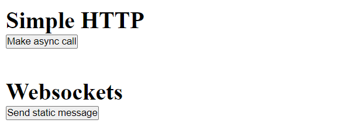

## About this project

This repository contains:

- frontend: A simple client built with React, Typescript and Vite.
- backend: A simple node server that supports http and websockets.

## Like I said, very simple:

